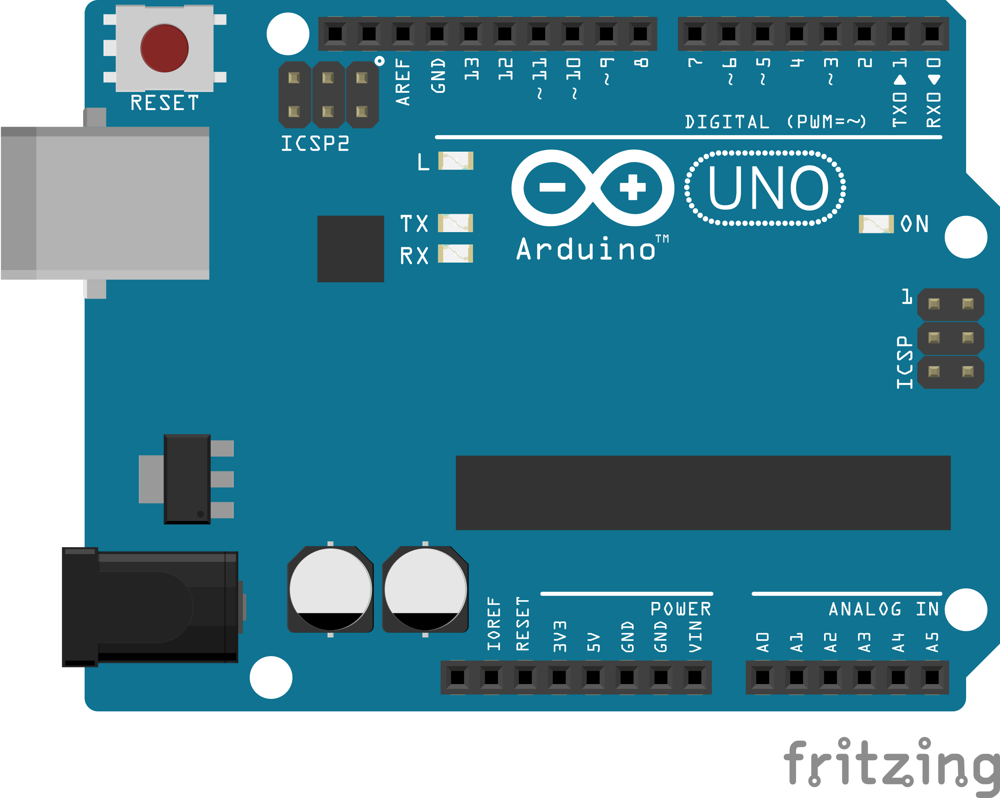

# Learning Arduino
Simple programs in arduino
***

## Description
This project is meant to help anyone kickstart their embedded C  learning

### A sample of arduino uno
***

## Contributions
***
All contributions are welcome to the project

