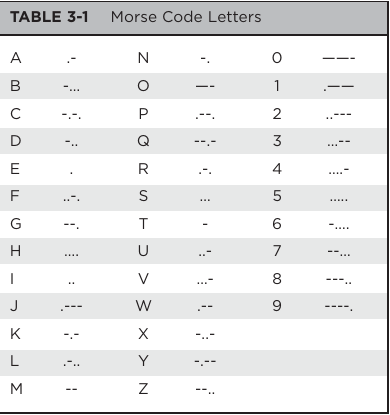

#   Morse Code Translator

Translates a string into LED flashing Morse code

## Hardware required
1. Arduino (uno or similar)
2. Bread Board
3. LED
4. Jumper wires
5. 220 OHM resistor

## Morse Code Translation Table

